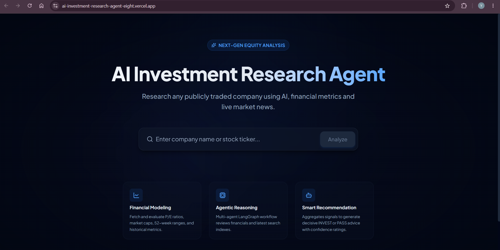
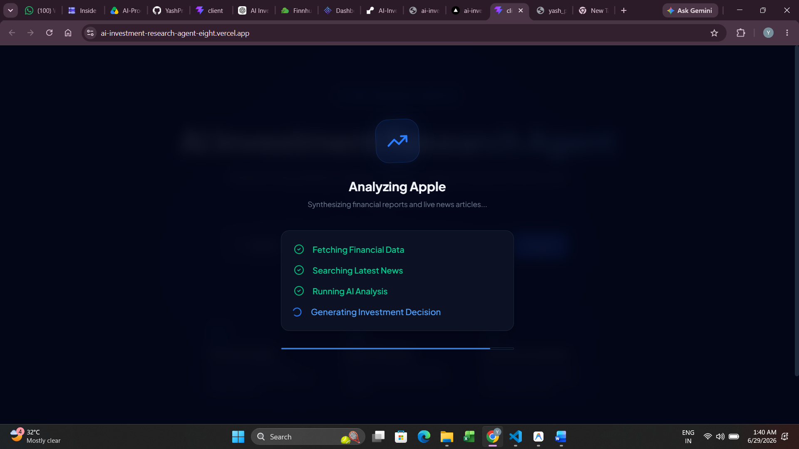

# 🤖 AI Investment Research Agent

**InsideIIM × Altuni AI Labs – AI Product Development Engineer (Intern) Take-Home Assignment**

---
# 🌐 Live Demo

Frontend :- https://ai-investment-research-agent-eight.vercel.app/

Backend :- https://ai-investment-research-agent-a80h.onrender.com/

# Overview

The AI Investment Research Agent is a full-stack AI application that performs end-to-end investment research for publicly traded companies. A user simply enters the name of a company (e.g., Apple, NVIDIA, Microsoft, Tesla), and the system automatically collects financial information and recent market news before using Large Language Models (LLMs) to analyze the company and generate an investment recommendation.

The application is built as a multi-stage AI workflow using **LangGraph**, where each AI agent performs a dedicated responsibility. The workflow first gathers structured financial information and recent news, then performs qualitative analysis, evaluates investment risks, and finally generates a recommendation of either **INVEST** or **PASS**, along with confidence and reasoning.

The goal of the project is not only to automate investment research but also to demonstrate how multiple AI agents can collaborate to solve a real-world business problem.

---

# Tech Stack

## Frontend

* React (Vite)
* React Router
* Tailwind CSS
* Axios

## Backend

* Node.js
* Express.js
* LangGraph
* LangChain
* Groq LLM

## External APIs

* Finnhub API (Financial Data)
* Tavily Search API (News & Web Search)

---

# Features

* Search any publicly traded company
* Retrieve real-time financial information
* Retrieve latest company news
* AI-generated financial analysis
* Financial, Sentiment and Risk scoring
* Final AI investment recommendation
* Confidence score with reasoning
* Modern responsive dashboard
* Multi-agent workflow using LangGraph

---

# How to Run

## Clone Repository

```bash
git clone https://github.com/YOUR_USERNAME/AI-Investment-Research-Agent.git

cd AI-Investment-Research-Agent
```

---

## Backend Setup

```bash
cd server

npm install

npm run dev
```

---

## Frontend Setup

```bash
cd client

npm install

npm run dev
```

---

# Environment Variables

Create a `.env` file inside the **server** directory.

```env
GROQ_API_KEY=YOUR_GROQ_API_KEY

TAVILY_API_KEY=YOUR_TAVILY_API_KEY

FINNHUB_API_KEY=YOUR_FINNHUB_API_KEY
```

Create a `.env` file inside the **client** directory.

```env
VITE_API_URL=http://localhost:5000/api
```

For production deployment:

```env
VITE_API_URL=https://YOUR_RENDER_BACKEND_URL/api
```

---

# How It Works

The application follows a modular AI agent architecture implemented using LangGraph.

## Workflow

```text
User enters company name
            │
            ▼
Research Agent
            │
            ├── Fetch Financial Data (Finnhub API)
            │
            └── Search Latest News (Tavily)
            │
            ▼
Analysis Agent
            │
            ▼
Decision Agent
            │
            ▼
Final Investment Recommendation
            │
            ▼
React Dashboard
```

---

## Research Agent

Responsibilities:

* Fetch company financial information
* Retrieve recent news articles
* Summarize research using Groq LLM

---

## Analysis Agent

Responsibilities:

* Analyze financial health
* Analyze market sentiment
* Evaluate business risks
* Generate:

  * Financial Score
  * Sentiment Score
  * Risk Score
  * Strengths
  * Weaknesses

---

## Decision Agent

Responsibilities:

* Read analysis generated by the previous agent

* Evaluate investment opportunity

* Produce:

* Recommendation (INVEST / PASS)

* Confidence Score

* Investment Reasoning

* Potential Risks

---

# Project Architecture

```text
React Frontend
        │
        ▼
Express Backend
        │
        ▼
LangGraph Workflow
        │
 ┌──────┴────────┐
 │               │
 ▼               ▼
Finnhub      Tavily Search
 │               │
 └──────┬────────┘
        ▼
Research Agent
        ▼
Analysis Agent
        ▼
Decision Agent
        ▼
Frontend Dashboard
```

---

# Key Decisions & Trade-offs

## Why LangGraph?

Instead of placing all logic inside a single API endpoint, I chose LangGraph to separate the workflow into independent AI agents. This makes the application modular, easier to debug, and easier to extend in the future.

---

## Why Groq?

Groq provides extremely fast inference and integrates well with LangChain. The low latency improves the overall user experience during AI analysis.

---

## Why Finnhub?

Initially, Yahoo Finance was used to retrieve financial data. However, Yahoo Finance applies rate limits and blocks requests from cloud platforms such as Render, causing deployment failures. Finnhub provides a reliable REST API suitable for production deployment.

---

## Why Tavily?

Tavily is designed specifically for AI applications and provides relevant, up-to-date web search results, making it a strong choice for retrieving company news.

---

## Trade-offs

The current implementation focuses on generating an investment recommendation for a single company at a time.

To keep the scope manageable within the assignment timeline, the following features were intentionally left out:

* User authentication
* Portfolio management
* Historical stock charts
* PDF report export
* Company comparison
* Watchlists
* Persistent database storage

These can be added in future iterations without changing the existing architecture.

---

# Example Runs

## Example 1

Company:

Apple Inc.

Recommendation:

INVEST

Confidence:

90%

Financial Score:

85

Sentiment Score:

58

Risk Score:

40

---

## Example 2

Company:

Microsoft

Recommendation:

INVEST

Confidence:

92%

Financial Score:

89

Sentiment Score:

76

Risk Score:

28

---

## Example 3

Company:

Intel

Recommendation:

PASS

Confidence:

71%

Financial Score:

60

Sentiment Score:

48

Risk Score:

62

---
# Screenshots 
🏠 Home Page

⏳ Loading Screen

📊 Final Dashboard


# Future Improvements

If additional development time were available, I would extend the application with the following features:

* Portfolio Analyzer
* Compare Multiple Companies
* Historical Stock Charts
* AI Chat with Company Reports
* Export Investment Reports as PDF
* User Authentication
* Watchlists
* Live Stock Market Updates
* SEC Filing Analysis using Retrieval-Augmented Generation (RAG)
* Improved scoring model using deterministic financial metrics alongside LLM reasoning
* Enhanced UI with advanced visualizations and animations

---

# AI Usage

AI tools played a significant role throughout the development process.

They were used for:

* Brainstorming architecture
* Designing the LangGraph workflow
* Prompt engineering
* Debugging backend issues
* Improving React UI
* Error resolution
* Code optimization
* Documentation writing

The project was built iteratively by combining software engineering decisions with AI-assisted development.

---

# LLM Chat Logs (Bonus)

As requested in the assignment, the AI development process has been documented.

The project includes AI-assisted development conversations that demonstrate:

* Planning the architecture
* Prompt engineering
* LangGraph workflow design
* Debugging process
* UI improvements
* Backend integration

Relevant chat transcripts/logs are included separately as part of the submission to provide insight into the development thought process.

---

# Author

**Yash Pratap Rai**

GitHub:

https://github.com/YashPratapRai

LinkedIn:

https://www.linkedin.com/in/yashprataprai

---

# Thank You

Thank you for reviewing my submission. I enjoyed building this project and exploring how multi-agent AI workflows can automate investment research. I look forward to discussing the design decisions, architecture, and future improvements during the interview process.
